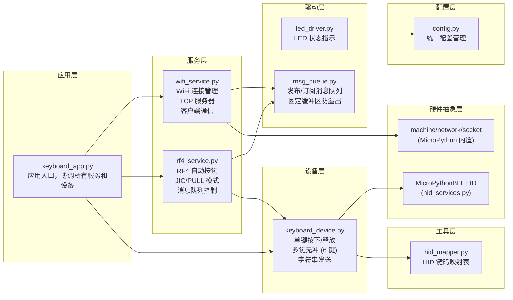
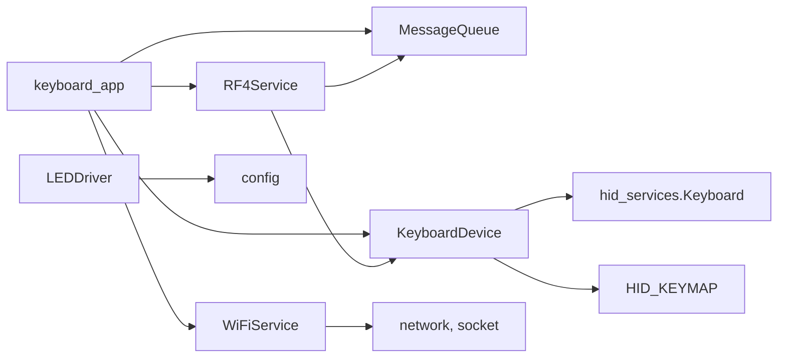
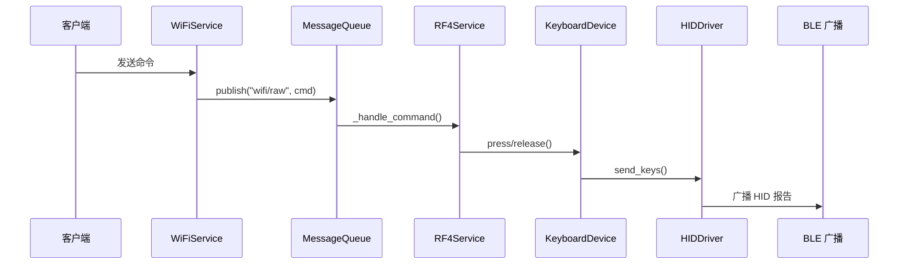
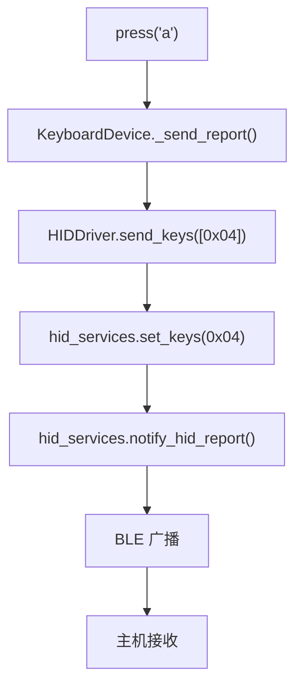
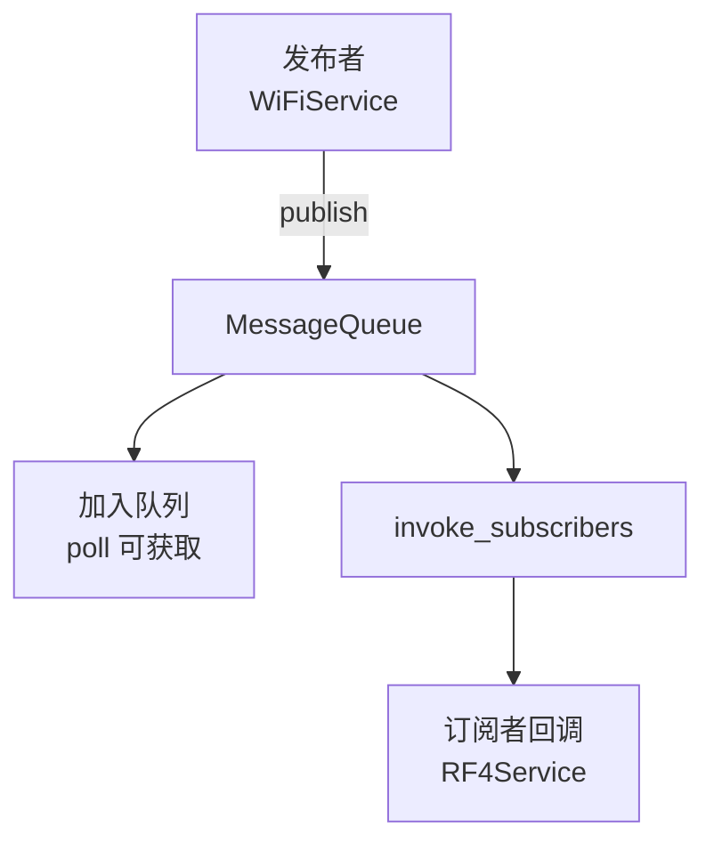

# ESP32 Keyboard 系统架构

## 概述

ESP32 Python Keyboard 是一个基于 MicroPython 的 BLE HID 键盘系统，采用分层架构设计，支持 WiFi 远程控制和自动按键功能。

## 分层架构图



## 模块依赖关系



## 数据流

### 1. WiFi 远程控制流程



### 2. HID 报告发送流程



### 3. 消息队列流程



## 状态管理

### KeyboardApp 状态
- `_running`: 运行标志
- 组件引用：`_msg_queue`, `_keyboard`, `_wifi`, `_rf4`

### WiFiService 状态
- `_connected`: WiFi 连接状态
- `_socket`: TCP 服务器 socket
- `_client`: 客户端连接

### RF4Service 状态
- `_state`: IDLE / JIG / PULL
- `_time_press`, `_time_release`: 时序参数

### HIDDriver 状态
- `_connected`: BLE 连接状态（通过回调更新）

## 错误处理

所有模块采用统一的错误处理模式：

```python
try:
    # 业务逻辑
    pass
except Exception as e:
    print(f"[ERROR] Module.method: {e}")
    import sys
    sys.print_exception(e)
    return False  # 或 None
```

## 配置管理

所有配置参数集中在 `src/config.py`：

| 类别 | 配置项 |
|------|--------|
| WiFi | SSID, PASSWORD, PORT, TIMEOUT |
| RF4 | JIG_PRESS_MS, JIG_RELEASE_MS, PULL_*, VARIANCE |
| HID | DEVICE_NAME, BATTERY_LEVEL, REPORT_INTERVAL |
| 硬件 | LED_PIN, BLINK_* |
| 系统 | MAIN_LOOP_INTERVAL_MS, DEBUG_ENABLED |

## 项目结构

```
esp32-python-keyboard/
├── boot.py              # ESP32 启动脚本（设备根目录）
├── src/
│   ├── main.py          # 应用入口
│   ├── config.py        # 统一配置
│   ├── keyboard_app.py  # 应用协调器
│   ├── keyboard_device.py   # 键盘设备（直接使用 hid_services）
│   ├── hid_mapper.py        # HID 映射表
│   ├── led_driver.py        # LED 驱动
│   ├── msg_queue.py         # 消息队列
│   ├── wifi_service.py      # WiFi 服务
│   └── rf4_service.py       # RF4 服务
```
