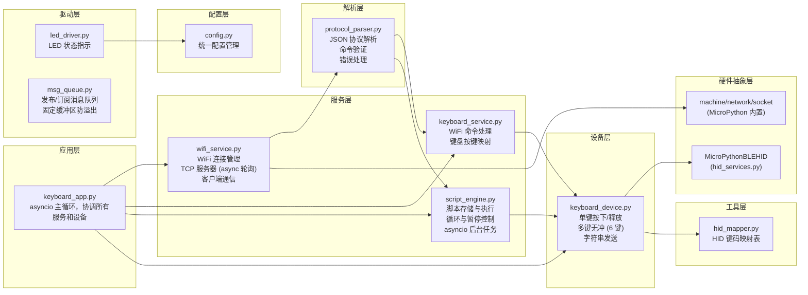
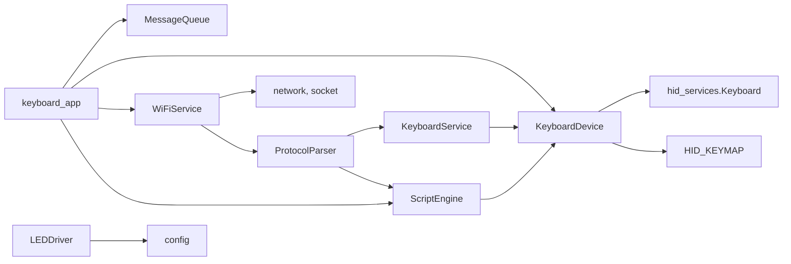
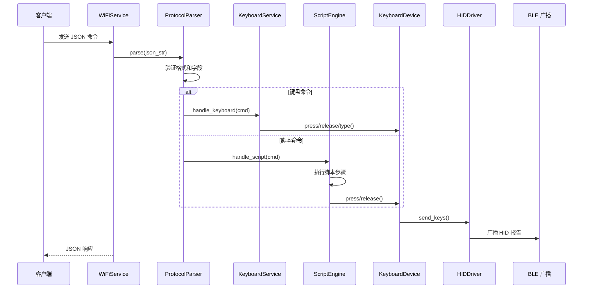
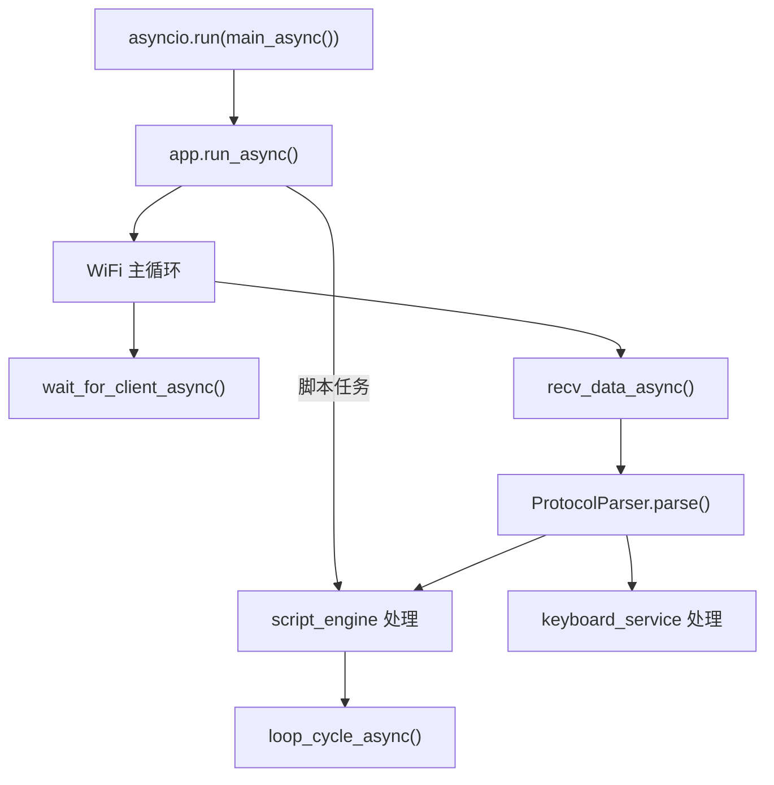
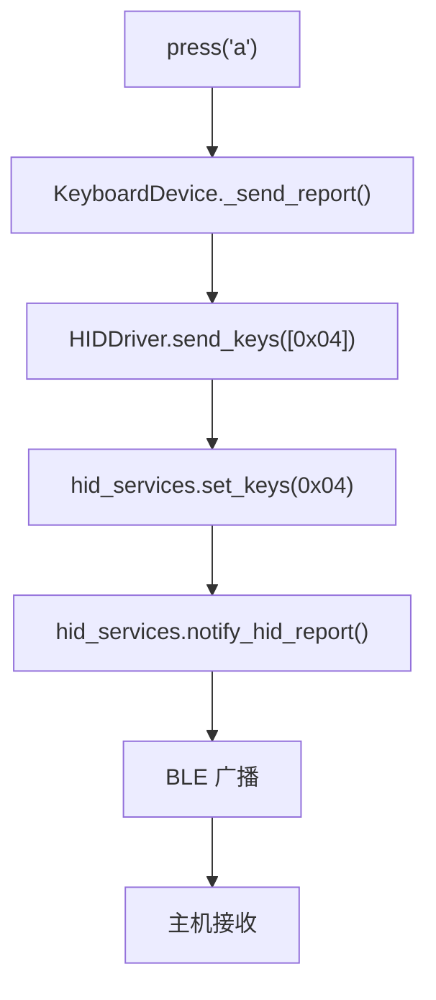
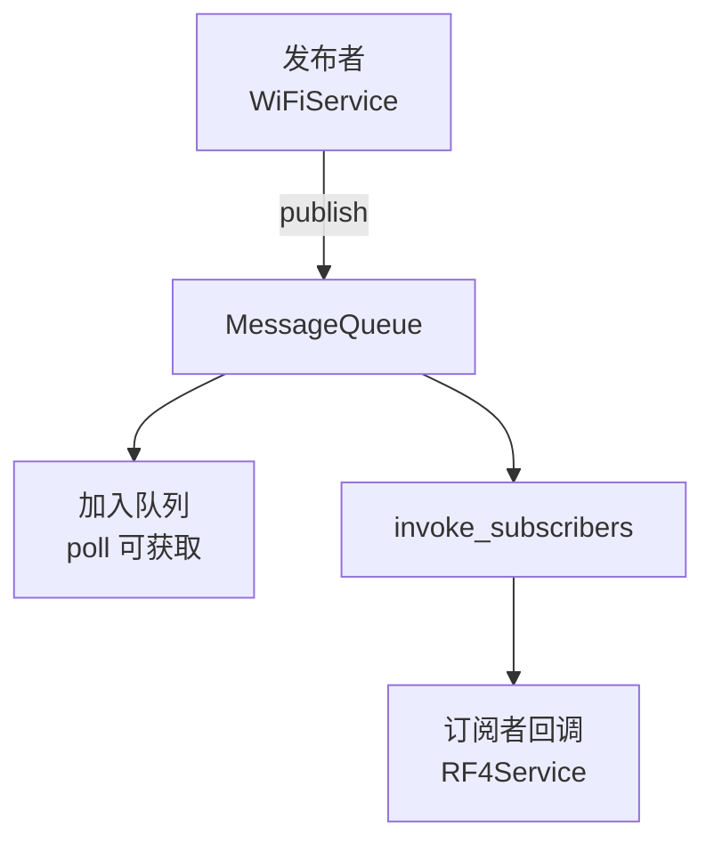

# ESP32 Keyboard 系统架构

## 概述

ESP32 Python Keyboard 是一个基于 MicroPython 的 BLE HID 键盘系统，采用分层架构设计，支持 WiFi 远程控制和自动按键功能。

## 分层架构图


```mermaid
flowchart LR
    subgraph App["应用层"]
        KA["keyboard_app.py<br/>asyncio 主循环，协调所有服务和设备"]
    end
    
    subgraph Services["服务层"]
        WS["wifi_service.py<br/>WiFi 连接管理<br/>TCP 服务器 (async 轮询)<br/>客户端通信"]
        KS["keyboard_service.py<br/>WiFi 命令处理<br/>键盘按键映射"]
        SE["script_engine.py<br/>脚本存储与执行<br/>循环与暂停控制<br/>asyncio 后台任务"]
    end
    
    subgraph Parsers["解析层"]
        PP["protocol_parser.py<br/>JSON 协议解析<br/>命令验证<br/>错误处理"]
    end
    
    subgraph Devices["设备层"]
        KD["keyboard_device.py<br/>单键按下/释放<br/>多键无冲 (6 键)<br/>字符串发送"]
    end
    
    subgraph Drivers["驱动层"]
        LD["led_driver.py<br/>LED 状态指示"]
        MQ["msg_queue.py<br/>发布/订阅消息队列<br/>固定缓冲区防溢出"]
    end
    
    subgraph Config["配置层"]
        CFG["config.py<br/>统一配置管理"]
    end
    
    subgraph Utils["工具层"]
        HM["hid_mapper.py<br/>HID 键码映射表"]
    end
    
    subgraph Hardware["硬件抽象层"]
        MPH["MicroPythonBLEHID<br/>(hid_services.py)"]
        NATIVE["machine/network/socket<br/>(MicroPython 内置)"]
    end
    
    KA --> WS
    KA --> KS
    KA --> SE
    WS --> PP
    PP --> KS
    PP --> SE
    KS --> KD
    SE --> KD
    KA --> KD
    KD --> MPH
    WS --> NATIVE
    KD --> HM
    LD --> CFG
```

## 模块依赖关系


```mermaid
flowchart LR
    KA[keyboard_app] --> MQ[MessageQueue]
    KA --> KD[KeyboardDevice]
    KA --> WS[WiFiService]
    KA --> SE[ScriptEngine]
    
    KD --> HSK[hid_services.Keyboard]
    KD --> HM[HID_KEYMAP]
    
    WS --> NET[network, socket]
    WS --> PP[ProtocolParser]
    
    PP --> KS[KeyboardService]
    PP --> SE
    
    KS --> KD
    SE --> KD
    
    LD[LEDDriver] --> CFG[config]
```

## 数据流

### 1. WiFi 远程控制流程


```mermaid
sequenceDiagram
    participant Client as 客户端
    participant WS as WiFiService
    participant PP as ProtocolParser
    participant KS as KeyboardService
    participant SE as ScriptEngine
    participant KD as KeyboardDevice
    participant HD as HIDDriver
    participant BLE as BLE 广播
    
    Client->>WS: 发送 JSON 命令
    WS->>PP: parse(json_str)
    PP->>PP: 验证格式和字段
    alt 键盘命令
        PP->>KS: handle_keyboard(cmd)
        KS->>KD: press/release/type()
    else 脚本命令
        PP->>SE: handle_script(cmd)
        SE->>SE: 执行脚本步骤
        SE->>KD: press/release()
    end
    KD->>HD: send_keys()
    HD->>BLE: 广播 HID 报告
    WS-->>Client: JSON 响应
```

### 2. asyncio 并发模型


```mermaid
flowchart TD
    Main["asyncio.run(main_async())"] --> App["app.run_async()"]
    App -->|脚本任务 | SE["script_engine.run_async()"]
    App --> WiFi["WiFi 主循环"]
    SE --> Loop["loop_cycle_async()"]
    WiFi --> Wait["wait_for_client_async()"]
    WiFi --> Recv["recv_data_async()"]
    Recv --> PP["ProtocolParser.parse()"]
    PP --> KS["keyboard_service 处理"]
    PP --> SE["script_engine 处理"]
```

### 2. HID 报告发送流程


```mermaid
flowchart TD
    A["press('a')"] --> B["KeyboardDevice._send_report()"]
    B --> C["HIDDriver.send_keys([0x04])"]
    C --> D["hid_services.set_keys(0x04)"]
    D --> E["hid_services.notify_hid_report()"]
    E --> F["BLE 广播"]
    F --> G["主机接收"]
```

### 3. 消息队列流程


```mermaid
flowchart TD
    Pub[发布者<br/>WiFiService] -->|publish| MQ[MessageQueue]
    MQ --> Q[加入队列<br/>poll 可获取]
    MQ --> Sub[invoke_subscribers]
    Sub --> CB[订阅者回调<br/>RF4Service]
```

## 状态管理

### KeyboardApp 状态
- `_running`: 运行标志
- 组件引用：`_msg_queue`, `_keyboard`, `_wifi`, `_script_engine`

### WiFiService 状态
- `_connected`: WiFi 连接状态
- `_socket`: TCP 服务器 socket
- `_client`: 客户端连接

### ScriptEngine 状态
- `_scripts`: 脚本字典 (name → steps)
- `_running`: 运行标志
- `_paused`: 暂停标志
- `_current_script`: 当前脚本名称

### HIDDriver 状态
- `_connected`: BLE 连接状态（通过回调更新）

## 错误处理

所有模块采用统一的错误处理模式：

```python
try:
    # 业务逻辑
    pass
except Exception as e:
    print(f"[ERROR] Module.method: {e}")
    import sys
    sys.print_exception(e)
    return False  # 或 None
```

## 配置管理

所有配置参数集中在 `src/config.py`：

| 类别 | 配置项 |
|------|--------|
| WiFi | SSID, PASSWORD, PORT, TIMEOUT |
| RF4 | JIG_PRESS_MS, JIG_RELEASE_MS, PULL_*, VARIANCE |
| HID | DEVICE_NAME, BATTERY_LEVEL, REPORT_INTERVAL |
| 硬件 | LED_PIN, BLINK_* |
| 系统 | MAIN_LOOP_INTERVAL_MS, DEBUG_ENABLED |

## 项目结构

```
esp32-python-keyboard/
├── boot.py              # ESP32 启动脚本（保留空文件）
├── main.py              # 应用入口（设备上 /main.py）
└── src/
    ├── config.py            # 统一配置
    ├── keyboard_app.py      # 应用协调器
    ├── keyboard_device.py   # 键盘设备（直接使用 hid_services）
    ├── keyboard_service.py  # 键盘命令处理
    ├── protocol_parser.py   # JSON 协议解析器
    ├── script_engine.py     # 脚本引擎
    ├── hid_mapper.py        # HID 映射表
    ├── led_driver.py        # LED 驱动
    ├── msg_queue.py         # 消息队列
    └── wifi_service.py      # WiFi 服务
```

## 后续优化项

### 1. 异常处理增强

建议在 `main.py` 中添加崩溃后自动重启功能：

```python
import machine

try:
    await app.run_async()
except KeyboardInterrupt:
    print("Interrupted by user")
except Exception as e:
    print("Fatal error:")
    sys.print_exception(e)
    machine.reset()  # 崩溃后自动重启
finally:
    led.value(0)
```

**优点：**
- 崩溃后自动恢复，无需手动重启
- 调试时可按 Ctrl+C 进入 REPL

**当前状态：** 暂未实现，作为可选优化项。
