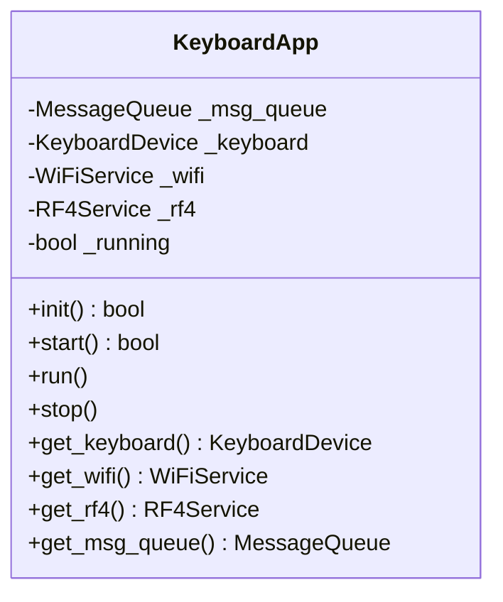

# KeyboardApp - 应用层设计

## 概述

`KeyboardApp` 是 ESP32 Keyboard 的应用层入口，负责协调所有服务和设备组件的初始化、启动和运行。

## 类结构



## 核心方法

### init()
初始化所有组件：
1. 创建消息队列
2. 启动键盘设备
3. 启动 WiFi 服务
4. 创建 RF4 服务

Returns: `bool` - 是否成功

### start()
启动应用主循环：
1. 调用 `init()`
2. 启动键盘广播
3. 连接 WiFi 并启动服务器

Returns: `bool` - 是否成功

### run()
运行主循环（阻塞）：
- 轮询 WiFi 数据接收
- 调用 RF4 服务循环
- 主循环间隔：`MAIN_LOOP_INTERVAL_MS`

### stop()
停止应用：
- 关闭 WiFi 连接

### get_*()
获取组件引用的访问器方法。

## 初始化流程

```mermaid
flowchart TD
    Main[main.py] --> App[KeyboardApp]
    App --> Start[app.start()]
    Start --> Init[app.init()]
    
    Init --> MQ[MessageQueue~max_size=10~]
    Init --> KB[KeyboardDevice.start()]
    Init --> WiFi[WiFiService.start()]
    Init --> RF4[RF4Service~keyboard, msg_queue~]
    
    Start --> Adv[KeyboardDevice.start_advertising()]
    Start --> Conn[WiFiService.connect()]
    Conn --> Srv[WiFiService.start_server()]
```

## 主循环

```python
while self._running:
    # WiFi 数据接收（非阻塞）
    if self._wifi.is_connected():
        data = self._wifi.recv_data()
        if data:
            print(f"[RECV] {data}")
    
    # RF4 状态检查
    # (RF4 服务有自己的内部循环)
    
    time.sleep_ms(MAIN_LOOP_INTERVAL_MS)
```

## 组件依赖

| 依赖 | 用途 |
|------|------|
| `MessageQueue` | 模块间通信 |
| `KeyboardDevice` | HID 键盘功能 |
| `WiFiService` | WiFi 远程控制 |
| `RF4Service` | 自动按键功能 |

## 使用示例

```python
from app.keyboard_app import KeyboardApp

app = KeyboardApp()

if app.start():
    app.run()
```

## 错误处理

所有方法内部捕获异常并打印详细信息，返回 `False` 表示失败。
