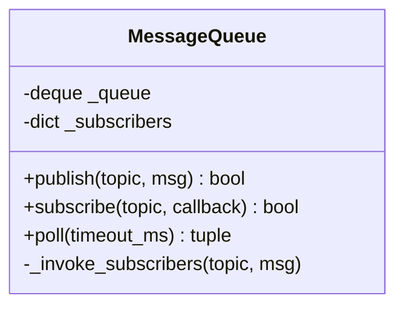

# MessageQueue - 消息队列设计

## 概述

提供发布/订阅模式的消息队列，支持固定大小缓冲区，防止内存溢出。

## 类结构



## 核心方法

### publish(topic, msg)
发布消息到队列：
1. 加入队列
2. 调用订阅者回调

Returns: `bool`

### subscribe(topic, callback)
订阅主题：
- 支持多订阅者
- 支持通配符 `*`

Returns: `bool`

### poll(timeout_ms=0)
轮询消息：
- `timeout_ms=0`: 非阻塞
- `timeout_ms>0`: 阻塞等待

Returns: `(topic, msg)` 或 `None`

## 发布/订阅流程

```mermaid
flowchart TD
    Pub["publisher.publish~'wifi/raw', 'jig;100;200'~"] --> A["_queue.append~...]
    A --> B["_invoke_subscribers~'wifi/raw', 'jig;100;200'~"]
    B --> C["for callback in _subscribers['wifi/raw']"]
    C --> D["callback~'jig;100;200'~"]
```

## 通配符订阅

```python
mq.subscribe("*", global_handler)  # 接收所有消息
```

## 缓冲区管理

使用 `collections.deque(maxlen=max_size)` 自动丢弃旧消息：
```python
queue = deque(maxlen=10)  # 最多 10 条消息
```

## 使用示例

```python
from drivers.msg_queue import MessageQueue

mq = MessageQueue(max_size=10)

# 订阅
def handler(msg):
    print(f"Received: {msg}")

mq.subscribe("rf4/control", handler)

# 发布
mq.publish("rf4/control", "jig;100;200")

# 轮询
msg = mq.poll(timeout_ms=100)
if msg:
    topic, data = msg
```
