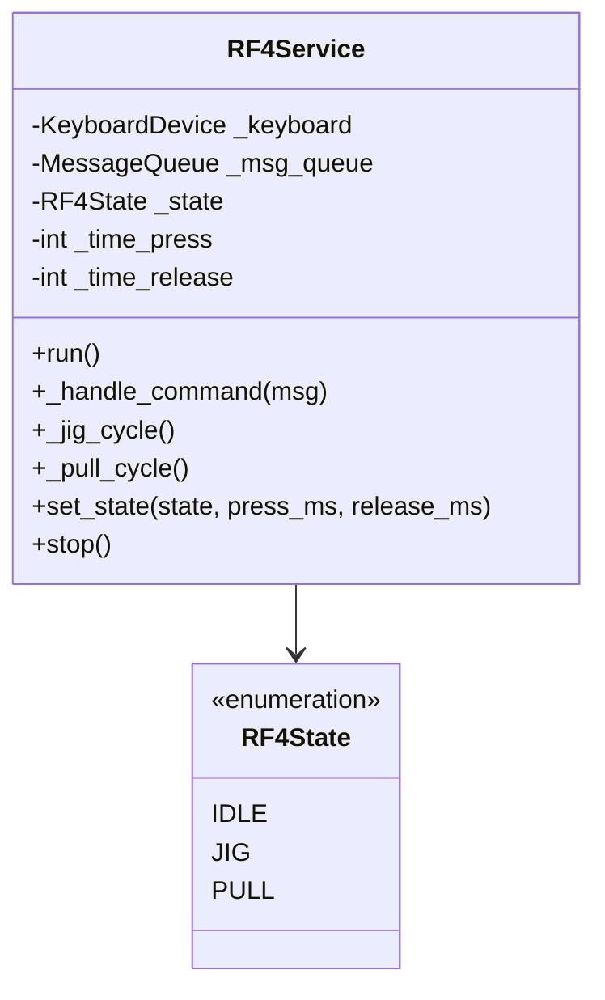
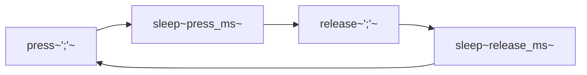

# RF4Service - RF4 自动按键服务设计

## 概述

实现 RF4 自动按键功能，支持 JIG 和 PULL 两种模式，通过消息队列接收控制命令。

## 类结构



## 运行模式

### JIG 模式

自动按压分号键 (`;`)：



### PULL 模式

自动按压分号和单引号键 (`;` + `'`)：

```mermaid
flowchart LR
    A["press~';'~ + press~\"'\"~"] --> B["sleep~press_ms~"]
    B --> C["release~\"'\"~"]
    C --> D["sleep~release_ms~"]
    D --> A
```

## 状态转换

```mermaid
stateDiagram-v2
    [*] --> IDLE
    
    IDLE --> JIG : jig;press_ms;release_ms
    JIG --> IDLE : clear
    JIG --> JIG : _jig_cycle()
    
    IDLE --> PULL : pull;press_ms;release_ms
    PULL --> IDLE : clear
    PULL --> PULL : _pull_cycle()
    
    note right of JIG
        自动按压分号键
        press_ms / release_ms
    end note
    
    note right of PULL
        自动按压分号 + 单引号
        press_ms / release_ms
    end note
```



## 核心方法

### run()
运行服务主循环（阻塞）：
```python
while True:
    if _state == JIG:
        _jig_cycle()
    elif _state == PULL:
        _pull_cycle()
    else:
        sleep(2)  # IDLE
```

### _handle_command(msg)
处理控制命令：

| 命令格式 | 说明 |
|----------|------|
| `jig;press_ms;release_ms` | 切换到 JIG 模式 |
| `pull;press_ms;release_ms` | 切换到 PULL 模式 |
| `clear` | 停止自动按键 |

### _random_sleep_ms(base_ms)
添加随机延迟（±10%）防止检测：
```python
variance = base_ms * RF4_RANDOM_VARIANCE
delay = random.uniform(base_ms - variance, base_ms + variance)
```

## 消息队列集成

订阅 `rf4/control` 主题：
```python
msg_queue.subscribe("rf4/control", self._handle_command)
```

## 配置参数

| 参数 | 默认值 | 说明 |
|------|--------|------|
| `RF4_JIG_PRESS_MS` | 1135 | JIG 按压时间 |
| `RF4_JIG_RELEASE_MS` | 1985 | JIG 释放时间 |
| `RF4_PULL_PRESS_MS` | 800 | PULL 按压时间 |
| `RF4_PULL_RELEASE_MS` | 500 | PULL 释放时间 |
| `RF4_RANDOM_VARIANCE` | 0.1 | 随机方差 (10%) |

## 控制命令示例

```bash
# JIG 模式，1135ms 按压，1985ms 释放
echo "jig;1135;1985" | nc <ESP32_IP> 80

# PULL 模式，800ms 按压，500ms 释放
echo "pull;800;500" | nc <ESP32_IP> 80

# 停止
echo "clear" | nc <ESP32_IP> 80
```

## 使用示例

```python
# 创建服务（需要键盘设备和消息队列）
rf4 = RF4Service(keyboard_device, msg_queue)

# 运行（阻塞）
rf4.run()

# 或直接控制状态
rf4.set_state(RF4State.JIG, press_ms=1000, release_ms=2000)
```
