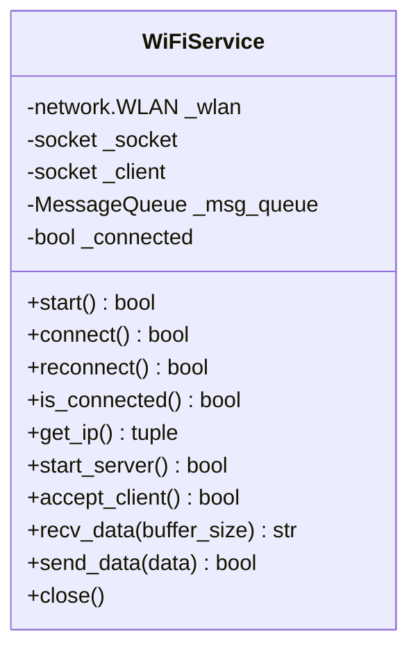
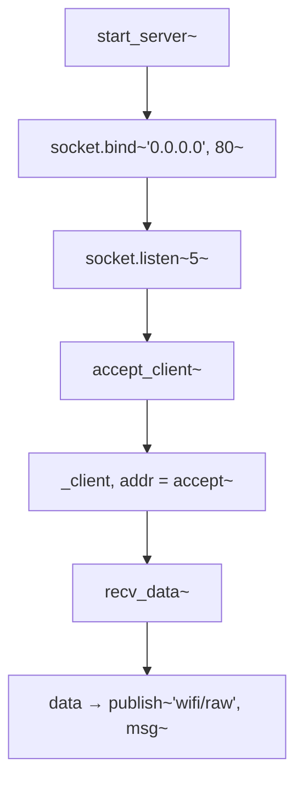

# WiFiService - WiFi 服务设计

## 概述

封装 ESP32 WiFi 功能，提供 TCP 服务器和客户端通信，支持自动重连和消息队列集成。

## 类结构



## 核心方法

### 连接管理

| 方法 | 描述 |
|------|------|
| `start()` | 激活 WiFi 接口 |
| `connect()` | 连接到配置的 AP |
| `reconnect()` | 重新连接 |
| `is_connected()` | 检查连接状态 |
| `get_ip()` | 获取 IP 地址 |

### 服务器功能

| 方法 | 描述 |
|------|------|
| `start_server()` | 启动 TCP 服务器（端口 80） |
| `accept_client()` | 接受客户端连接 |
| `recv_data(buffer_size)` | 接收数据 |
| `send_data(data)` | 发送数据 |
| `close()` | 关闭连接 |

## WiFi 连接流程

```mermaid
flowchart TD
    A[WiFiService.start()] --> B[wlan.active~True~]
    B --> C[wlan.connect~SSID, PASSWORD~]
    C --> D{轮询 isconnected~}
    D -->|超时：WIFI_TIMEOUT_SEC| E[_connected = True]
```

## TCP 服务器流程



## 消息队列集成

接收到的数据自动发布到消息队列：

```python
def recv_data(self, buffer_size=1024):
    if self._client:
        data = self._client.recv(buffer_size)
        if data:
            msg = data.decode('utf-8')
            if self._msg_queue:
                self._msg_queue.publish("wifi/raw", msg)
            return msg
```

## 配置参数

| 参数 | 默认值 | 说明 |
|------|--------|------|
| `WIFI_SSID` | "T" | WiFi 名称 |
| `WIFI_PASSWORD` | "12345678" | WiFi 密码 |
| `WIFI_PORT` | 80 | TCP 端口 |
| `WIFI_TIMEOUT_SEC` | 30 | 连接超时 |
| `WIFI_SOCKET_TIMEOUT_SEC` | 1800 | Socket 超时 |

## 错误处理

所有方法捕获异常并打印：
```python
except Exception as e:
    print(f"[ERROR] WiFiService.{method}: {e}")
    sys.print_exception(e)
    return False
```

## 使用示例

```python
# 创建服务
wifi = WiFiService(msg_queue=mq)

# 启动并连接
wifi.start()
wifi.connect()

# 启动服务器
wifi.start_server()

# 接收数据
data = wifi.recv_data()
if data:
    print(f"Received: {data}")
```
